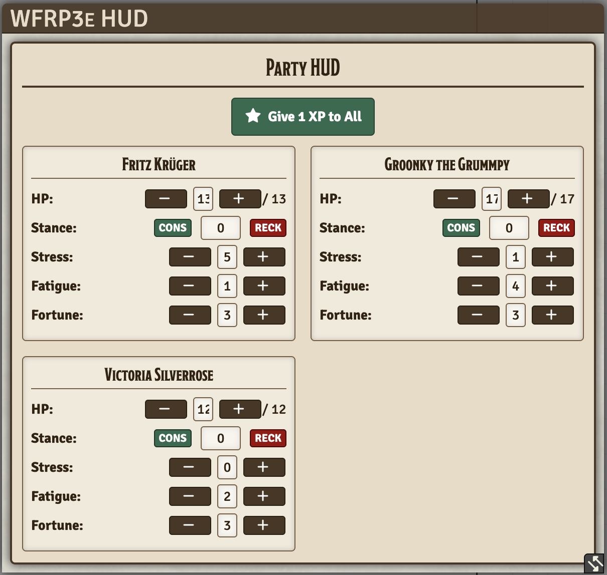

# WFRP3e Player HUD

A Foundry VTT module designed for the Warhammer Fantasy Roleplay 3rd Edition (wfrp3e) system. It provides a highly accessible Heads-Up Display (HUD) for both players and game masters.

## Screenshot

## Features
- **Player HUD:** Automatically pops up for players, giving them immediate access to their HP (Wounds), Stance, Stress, Fatigue, and Fortune without opening their character sheet.
- **Party HUD (GM):** Displays a compact grid of all player characters, allowing the Game Master to track and modify everyone's stats instantly.
- **Give 1 XP to All:** A convenient button for the GM to award 1 Experience Point to all player characters simultaneously.
- **Stance Color Coding:** Stance is displayed as an absolute value, with the input box dynamically changing color (Green for Conservative, Red for Reckless) to make visual tracking immediate and obvious.
- **Always Accessible:** Can be toggled at any time using the ID card icon in the Token Scene Controls.

## Installation
You can install this module by pasting the raw manifest link into the Foundry VTT module installer:
`https://raw.githubusercontent.com/Natherul/whfrpg3ui/master/module.json`

## Usage
Simply log in. If you are a player with a character assigned, the HUD will appear. If you are a Game Master, the Party HUD will appear showing all assigned player characters. Use the `Cons` and `Reck` buttons to adjust Stance, or the `+` and `-` buttons for other stats. You can also click directly into the numbers to type a specific value.
